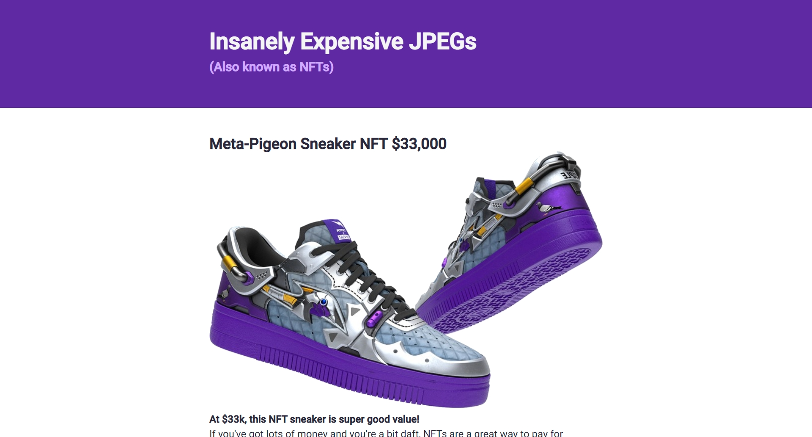

# Scrimba - The Frontend Developer Career Path - Module 4 - Build a NFT Site

This is a solution to the [Scrimba - The Frontend Developer Career Path - Module 4 - Build a NFT Site](https://scrimba.com/playlist/pWNEvSg). 

## About Scrimba

At Scrimba our goal is to create the best possible coding school at the cost of a gym membership! 💜
If we succeed with this, it will give anyone who wants to become a software developer a realistic shot at succeeding, regardless of where they live and the size of their wallets 🎉
The Frontend Developer Career Path aims to teach you everything you need to become a Junior Developer, or you could take a deep-dive with one of our advanced courses 🚀

## Table of contents

- [Scrimba - The Frontend Developer Career Path - Module 4 - Build a NFT Site](#scrimba---the-frontend-developer-career-path---module-4---build-a-nft-site)
  - [About Scrimba](#about-scrimba)
  - [Table of contents](#table-of-contents)
  - [Overview](#overview)
    - [The challenge](#the-challenge)
    - [Screenshot](#screenshot)
    - [Links](#links)
  - [My process](#my-process)
    - [Built with](#built-with)
    - [What I learned](#what-i-learned)
    - [Continued development](#continued-development)
  - [Author](#author)

## Overview

### The challenge

Build a NFT Site

### Screenshot

### Links

- Solution URL: [Github](https://github.com/varonalearns/Build-a-NFT-Site)
- Live Site URL: [Netlify Live Site](https://genuine-lolly-fb2227.netlify.app/)

## My process

### Built with

- Semantic HTML5 markup
- CSS custom properties

### What I learned
- Semantic HTML
- Hover and active states using pseudo selectors
- Specificity
- Compound selectors (and when to avoid them)
- Inline-block
- Multiple classes on one element
- 
### Continued development

I definitely want to learn more about Semantic HTML, especially for accessibility issues.

## Author

- Website - [Evalia Varona](https://www.evaliavarona.com)
- Hashnode - [@evavarona](https://evaliavarona.hashnode.dev)